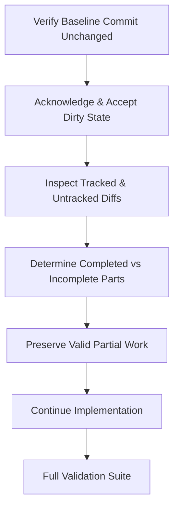

# Git Discipline & Working Tree Rules

This document defines the strict version control safety rules, dirty worktree protocols, checkpoint guidelines, and interrupted agent handoff procedures for FrameHub.

---

## Non-Negotiable Git Safety Constraints

Coding agents must **NEVER** perform the following destructive or rewriting operations unless explicitly instructed by the user:

- **NO Force Push**: Never run `git push --force` or `git push --force-with-lease`.
- **NO History Rewriting**: Never amend commits (`git commit --amend`) or rebase (`git rebase`).
- **NO Automatic Checkpoints**: Never run `git commit` or `git push` during standard implementation or review prompts unless the user explicitly requested a commit/push checkpoint.
- **NO Destructive Cleans**: Never run `git reset --hard`, `git clean -fd`, `git restore .`, or `git checkout .`.
- **NO Automatic Stashing**: Never stash user or agent changes (`git stash`).
- **NO Branch Switching**: Never create or switch branches unless explicitly requested.

---

## Dirty Worktree Safety Rules

When an agent begins a task that expects a clean baseline:

```powershell
git branch --show-current
git rev-parse HEAD
git rev-parse origin/main
git status --short --untracked-files=all
```

- **If the working tree is DIRTY unexpectedly**:
  1. **STOP immediately.**
  2. Do not reset, restore, stash, clean, or discard any files.
  3. Report: `[TASK NAME] BLOCKED BY DIRTY WORKTREE`.
  4. List the modified and untracked files in your response and await user instructions.

---

## Interrupted Agent Handoff Protocol

When an agent is interrupted mid-implementation (for instance, reaching model usage quotas or context exhaustion), a subsequent agent will be tasked with continuing from the dirty worktree.

The incoming agent must follow this exact handoff procedure:



1. **Verify Baseline**: Confirm `git branch --show-current` and `git rev-parse HEAD` match the task baseline.
2. **Inspect Existing Work**: Run `git status --short --untracked-files=all` and `git diff` to understand all partial changes.
3. **Preserve Valid Implementation**: **DO NOT discard, reset, or rewrite existing work wholesale** merely to match a personal coding style. Build upon the solid code already written.
4. **Complete Remaining Scope**: Address the remaining requirements, wire up missing UI/tests, and ensure consistency across files.
5. **Validate Entirety**: Execute the full validation suite (`dotnet build`, tests, `node --check`, `git diff --check`).

---

## Explicit Checkpoint Protocol

When the user explicitly instructs: *"Commit and push this milestone"* or *"Create a checkpoint"*:

1. **Pre-Commit Verification**: Run the full validation suite (see [VALIDATION.md](VALIDATION.md)).
2. **Targeted Staging**: Stage ONLY the exact files intended for this milestone (`git add <file1> <file2>...`). Do not stage unrelated files or untracked artifacts.
3. **Staging Inspection**:
   ```powershell
   git diff --cached --check
   git diff --cached --stat
   git status --short --untracked-files=all
   ```
4. **Single Meaningful Commit**: Create exactly one commit using conventional commit prefixes (`feat: ...`, `fix: ...`, `docs: ...`, `refactor: ...`):
   ```powershell
   git commit -m "feat: [concise description of feature]"
   ```
5. **Post-Commit Verification**:
   ```powershell
   git rev-parse HEAD
   git rev-parse HEAD^
   git status --short --untracked-files=all
   ```
6. **Push to Remote**:
   ```powershell
   git push origin main
   ```
7. **Post-Push Confirmation**: Verify `origin/main == local HEAD` and `git status -sb` is clean.
