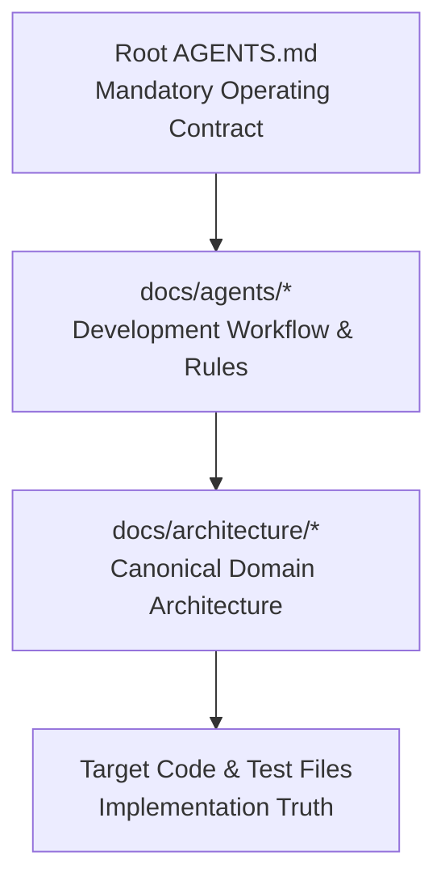

# FrameHub Agent Documentation System

Welcome to the agent documentation and development guidance index for FrameHub.

FrameHub is a high-performance Windows gaming optimization toolkit. This documentation system ensures that coding agents and contributors navigate the codebase efficiently, respect established architectural authorities, avoid duplicate implementations, and follow safe development workflows.

---

## Progressive Disclosure Model

To optimize context efficiency and prevent cognitive overload, agents should follow a progressive disclosure model:

1. **Root [AGENTS.md](../../AGENTS.md)**: The concise, mandatory operating contract. Read first for every task.
2. **`docs/agents/*`**: In-depth operational guides for workflows, reviews, validation, Git safety, and subsystem routing.
3. **`docs/architecture/*`**: Canonical architectural truth, service catalog, enforced invariants, and background work inventory.
4. **Target Source & Tests**: The concrete implementation reality.

---

## Agent Guidance Index

| Document | Purpose & Responsibility |
|---|---|
| [WORKFLOW.md](WORKFLOW.md) | Standard 7-phase development lifecycle, baseline verification, Reuse-First principle, New Abstraction Gate, and adapter rules. |
| [REVIEW.md](REVIEW.md) | Review severity levels (P0–P3), review report formatting, and the One-Review / One-Fix rule. |
| [VALIDATION.md](VALIDATION.md) | Authoritative build, test, lint, and diff validation commands; synthetic testing and safety principles. |
| [GIT.md](GIT.md) | Git safety constraints, dirty worktree handling, checkpoint protocol, and interrupted agent handoff guidelines. |
| [AREA-GUIDE.md](AREA-GUIDE.md) | Subsystem-by-subsystem map linking features to their canonical architecture docs and authoritative owners. |

---

## Canonical Architecture Links

When working on domain features, refer to the authoritative architecture documentation in `docs/architecture/`:

- [docs/ARCHITECTURE.md](../ARCHITECTURE.md) — Architecture landing page.
- [docs/architecture/OVERVIEW.md](../architecture/OVERVIEW.md) — Layers, composition, major flows, and persistence.
- [docs/architecture/SERVICE-CATALOG.md](../architecture/SERVICE-CATALOG.md) — Complete catalog of services, authorities, lifetimes, and extension points.
- [docs/architecture/FEATURE-MAP.md](../architecture/FEATURE-MAP.md) — Practical "I want to..." routing guide.
- [docs/architecture/INVARIANTS.md](../architecture/INVARIANTS.md) — Non-negotiable safety and authority invariants.
- [docs/architecture/BACKGROUND-WORK.md](../architecture/BACKGROUND-WORK.md) — Canonical inventory of timers, intervals, and recurring loops.
- [docs/architecture/REFACTOR-CANDIDATES.md](../architecture/REFACTOR-CANDIDATES.md) — Evidence-backed refactoring backlog.
- [docs/BENCHMARKING.md](../BENCHMARKING.md) — PresentMon capture, benchmark mathematics, and storage schema.
- [docs/ROADMAP.md](../ROADMAP.md) — Canonical product roadmap and scope boundaries.
