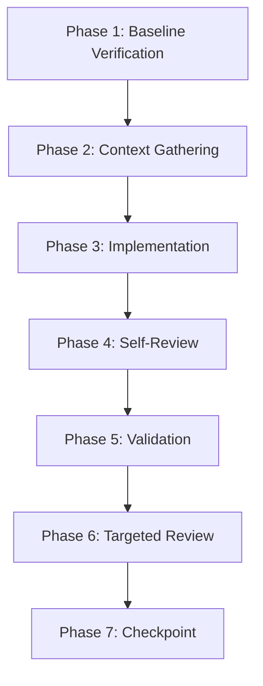
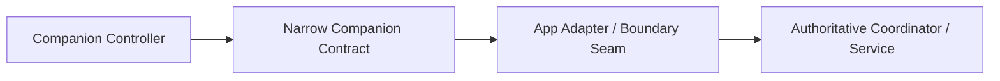

# Feature Development Workflow

This document details the standard 7-phase development lifecycle for coding agents and contributors in FrameHub.

---

## 7-Phase Development Lifecycle

Every coding task must follow this structured lifecycle:

### Phase 1 — Baseline Verification
- Verify current branch: `git branch --show-current` (typically `main`).
- Verify commit baseline: `git rev-parse HEAD` and `git rev-parse origin/main`.
- Inspect working tree: `git status --short --untracked-files=all`.
- **Worktree Safety**: If the worktree is dirty when a clean baseline was expected, **STOP** and report `BLOCKED`. Never automatically reset, clean, restore, or stash uncommitted changes. (See [GIT.md](GIT.md) for interrupted handoff exceptions).

### Phase 2 — Context Gathering
- Read [AGENTS.md](../../AGENTS.md) first.
- Read [AREA-GUIDE.md](AREA-GUIDE.md) to locate the canonical documentation for the feature area.
- Read relevant documents in `docs/architecture/` before designing or modifying code.
- Search for existing components that already own the required responsibility.

### Phase 3 — Implementation
- Adhere strictly to the **Reuse-First / Single-Owner** principle.
- Pass the **New Abstraction Gate** before creating any new class, service, manager, coordinator, or backend.
- Prefer the narrowest change that accomplishes the task. Avoid broad refactorings or style churn.
- Follow layer boundaries: `Core` (domain/native/storage), `App` (WPF/composition/adapters), `Companion` (HTTP/WS transport/presentation).
- Write focused automated tests that verify new or modified behavior.

### Phase 4 — Self-Review
- Perform a focused self-review of modified files.
- Check for duplicate ownership, missing error paths, authorization leaks, or broken invariants.
- Resolve any concrete P0/P1/P2 findings before proceeding to full validation.

### Phase 5 — Validation
- Run the full suite of authoritative validation commands (see [VALIDATION.md](VALIDATION.md)):
  - Release build (`dotnet build --configuration Release`).
  - Desktop test suite (`FrameHub.Tests`).
  - Companion test suite (`FrameHub.Companion.Tests`).
  - JavaScript syntax check (`Get-ChildItem -Path "FrameHub.Companion/wwwroot/js/*.js" | ForEach-Object { node --check $_.FullName }`).
  - Whitespace and diff hygiene (`git diff --check`).
- Confirm test counts match or exceed baseline and zero warnings/errors exist.

### Phase 6 — Targeted Review
- If instructed by the prompt or if milestone complexity warrants, perform ONE structured read-only review.
- Evaluate findings against established severity tiers: P0, P1, P2, P3 (see [REVIEW.md](REVIEW.md)).
- If P1/P2 findings exist, perform **ONE narrow fix round** and revalidate. Avoid endless review loops.

### Phase 7 — Checkpoint
- Default state at completion is **UNCOMMITTED / UNSTAGED** unless the prompt explicitly instructs a commit/push checkpoint.
- When explicitly requested:
  - Stage exact intended files only.
  - Create one descriptive commit following project conventions (`fix: ...`, `feat: ...`, `docs: ...`).
  - Push to remote branch without `--force`.
  - Verify `origin/main == HEAD` and working tree is clean.

---

## Non-Negotiable Principle: REUSE-FIRST / SINGLE-OWNER

FrameHub enforces strict single-ownership of domain authorities.

> [!IMPORTANT]
> **Before creating ANY new Service, Backend, Manager, Coordinator, Provider with domain logic, persistent worker, timer, polling loop, cache, state machine, process scanner, hardware monitor, PresentMon owner, or native mutation implementation: FIRST search for an existing owner.**

If an existing component already owns the responsibility:
- **DO NOT** create a parallel owner or second implementation.
- **DO** extend, improve, or reuse the existing owner.

### Consumers Are Not Responsibilities
A new consumer or presentation screen is never a new domain responsibility:
- **CPU Scheduling Example**: If Desktop needs CPU affinity, Companion needs CPU affinity, or a future API needs CPU affinity $\rightarrow$ **all of them must reuse `ProcessService`**. A new consumer is NEVER justification for creating `ProcessService2`, `CompanionCpuService`, or parallel native scheduling mechanics.
- Desktop UI, Companion UI, and REST API controllers are presentation layers. They do not justify new domain implementations.

---

## New Abstraction Gate

Before introducing any new Service, Manager, Coordinator, Backend, or domain-bearing Provider, you must explicitly answer these seven questions:

1. **What exact responsibility is new?**
2. **Which existing components were searched?**
3. **Why can the responsibility not coherently belong to an existing owner?**
4. **Does the new abstraction own state/lifecycle or merely adapt an existing owner?**
5. **Could this create two implementations of the same behavior?**
6. **Is this abstraction being created only because there is a new consumer/UI/API?** *(If YES: that alone is NOT sufficient justification).*
7. **Does this abstraction duplicate an existing owner's method semantics under a different name?** *(If YES: reuse/extend the existing owner instead).*

If you cannot provide concrete, compelling answers: **DO NOT CREATE THE ABSTRACTION.** Reuse or extend an existing owner.

---

## Adapter / Provider & Future Consolidation Rules

Narrow adapters and provider interfaces are appropriate at project boundaries (e.g. between `FrameHub.Companion` and `FrameHub.App`) to decouple transport from application composition.

However:
- **An adapter must DELEGATE, not implement domain logic.**
- Adapters must never duplicate process mutation, persistence, scheduling, validation policies, hardware monitoring, lifecycle, or benchmark calculations.
- **No Precedent for Wrappers**: If an existing adapter/backend contributes no meaningful boundary responsibility and merely forwards calls to an existing owner (such as `SessionCpuControlBackend` delegating to `ProcessService`), agents should **NOT** automatically create more adapters patterned after it. Prefer direct consolidation into the authoritative owner where layering allows; do not perform opportunistic architectural cleanup during unrelated feature work.

---

## Documentation-First & Ambiguity Discipline

- **No Invented Decisions**: When product requirements or UX concepts are underspecified, do NOT guess or silently invent requirements.
- **Documented Direction**: If canonical documentation (`docs/ROADMAP.md`, `docs/architecture/*`) defines the direction, follow it.
- **Explicit Uncertainty**: If multiple valid architectural or product choices exist, halt implementation, describe the tradeoffs clearly, or use an explicit `TBD` in documentation. Do not turn speculation into code.
- **Conflict Resolution**: If two documents contradict each other, do not silently pick one. Trace repository evidence to identify the intended rule, or raise the contradiction for human resolution.
